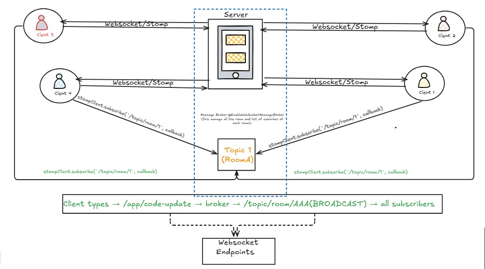

# Dev Hive — Live Collaborative Code Editor

A real-time collaborative code editor where multiple users join a shared room and write code together, with changes synced instantly across all clients.

---

## Tech Stack

| Layer | Technology |
|-------|------------|
| Frontend | React, Vite, TailwindCSS |
| Code Editor | Monaco Editor (`@monaco-editor/react`) |
| WebSocket Client | SockJS + STOMP.js (`@stomp/stompjs`) |
| Backend | Spring Boot |
| Real-time | WebSocket + STOMP |
| Cache / Pub-Sub | Redis |
| Database | PostgreSQL (Spring Data JPA) |
| Auth | JWT + Refresh Token (HttpOnly Cookie) |

## WebSocket Architecture

<p align="center">
  
</p>

---

## How It Works

Each keystroke is sent over STOMP to `CodeSyncController`, which writes the latest code to Redis and publishes it to a Redis Pub/Sub channel. `RedisMessageSubscriber` picks it up and broadcasts to `/topic/room/{roomId}`, reaching all connected clients in real time.

`RoomSyncScheduler` flushes Redis → PostgreSQL every 30 seconds for durability. On `endRoom`, a final sync runs before the Redis key is deleted.

---

## API Reference

### Auth — `/auth`

| Method | Endpoint | Description |
|--------|----------|-------------|
| `POST` | `/auth/signup` | Register a new user |
| `POST` | `/auth/login` | Login; sets HttpOnly refresh token cookie |
| `POST` | `/auth/refresh` | Rotate access + refresh token |
| `POST` | `/auth/logout` | Revoke token + clear cookie |

### Rooms — `/rooms`

| Method | Endpoint | Description |
|--------|----------|-------------|
| `POST` | `/rooms` | Create a room (caller becomes OWNER) |
| `POST` | `/rooms/{roomId}/join` | Join as EDITOR |
| `GET` | `/rooms/{roomId}` | Get room info (live code from Redis if available) |
| `DELETE` | `/rooms/{roomId}/end` | Owner ends room; final Redis → DB sync |
| `DELETE` | `/rooms/{roomId}/leave` | Participant leaves room |

### WebSocket — `ws://<host>/ws`

| Direction | Destination | Description |
|-----------|-------------|-------------|
| Client → Server | `/app/code-update/{roomId}` | Send a code change |
| Server → Client | `/topic/room/{roomId}` | Receive updates, join/leave events, room-end signal |

---

## Running Locally

**Prerequisites:** Java 21+, Maven, PostgreSQL, Redis

```yaml
# application.yml
spring:
  datasource:
    url: jdbc:postgresql://localhost:5432/devhive
    username: postgres
    password: yourpassword
  redis:
    host: localhost
    port: 6379
app:
  redis:
    channel: room:code-updates
```

```bash
redis-server
./mvnw spring-boot:run

# Frontend
npm install && npm run dev
```

---

## Design Notes

**Redis-first writes** — PostgreSQL can't absorb per-keystroke writes at scale. Redis buffers all updates in memory; the scheduler persists them at a safe cadence.

**Pub/Sub over direct broadcast** — In a multi-instance deployment, clients connect to different server nodes. Publishing through Redis ensures every node's subscriber relays the update to its own clients.

**Pessimistic locking on join** — Prevents two concurrent requests from both reading a non-full room and pushing it past capacity. The lock is short-lived and join frequency is low, so contention is negligible.