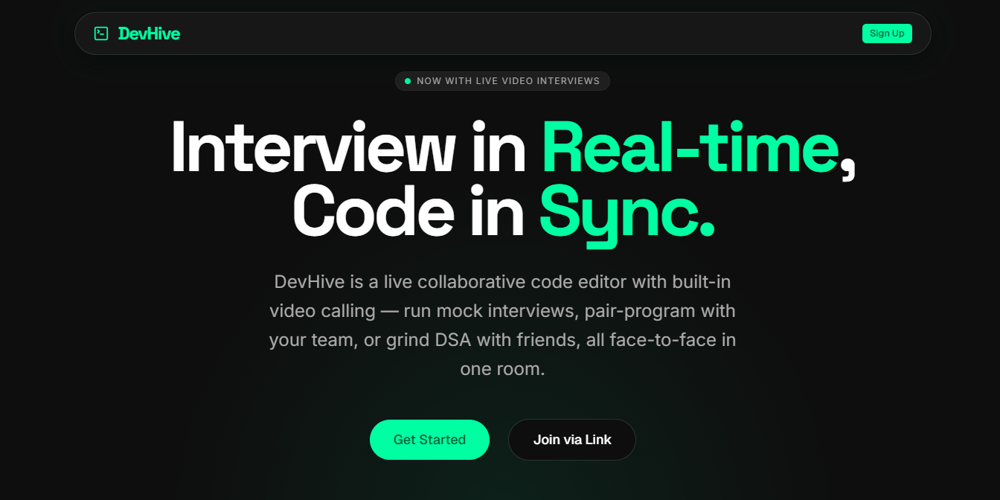
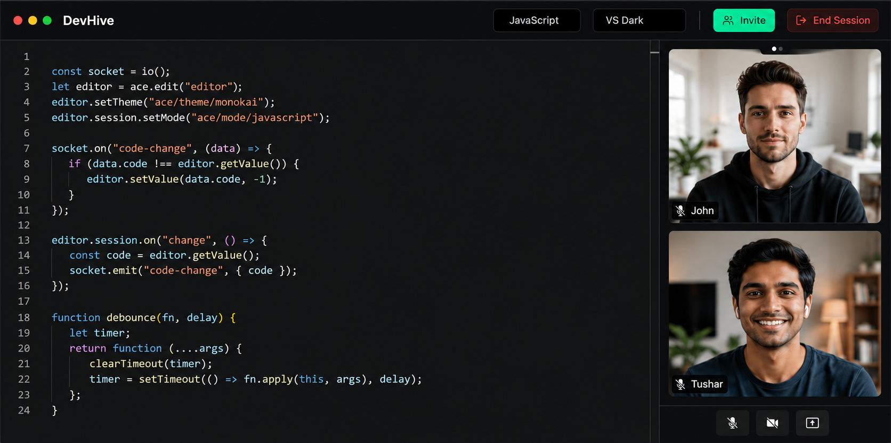
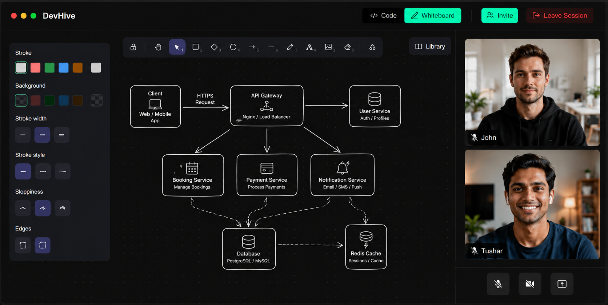

# Dev Hive - Interview in real-time, code in sync

DevHive is a live collaborative code editor with built-in video calling and a synced whiteboard. Run mock interviews, pair-program with your team, grind DSA, or practice system design with friends — all face-to-face in one room.

**Live Demo:** http://devhive.tushardev.me

<p align="center">
  
</p>

<p align="center">
  
</p>
<p align="center">
  
</p>

---

## Features


- **Real-Time Code Collaboration** — Monaco Editor synced live across all room participants via WebSocket
- **Video & Audio Calling** — LiveKit-powered WebRTC integration directly inside coding rooms
- **WebSocket Messaging** — STOMP over SockJS for bi-directional client-server communication
- **Redis Write-Through Cache** — live code/language updates hit Redis first, avoiding DB writes on every keystroke
- **Scheduled DB Sync** — background cron job (every 30s) persists cached Redis code back to the database
- **Redis Pub/Sub Broadcasting** — decouples publisher/subscriber for horizontally scalable, multi-instance WebSocket delivery
- **Collision-Safe Room IDs** — auto-generated unique room IDs with retry logic on conflict
- **Concurrency-Safe Joins** — pessimistic locking prevents race conditions when multiple users join simultaneously
- **Reconnect Handling** — rejoining users get re-synced state (`USER_REJOIN`) instead of duplicate participant entries
- **Live Room Events** — real-time broadcasts for user joined, left, rejoined, and room closed
- **JWT Authentication** — short-lived access tokens + long-lived refresh tokens (6 months) in HTTP-only cookies
- **Role-Based LiveKit Tokens** — per-user JWT tokens with admin grants for room owners
- **Automatic Call Lifecycle Management** — LiveKit room auto-created on call start, cleaned up on room end, participants auto-removed on leave
- **Cache-Aside Fallback** — graceful handling and logging of Redis cache misses with DB fallback
- **Global Exception Handling** — custom exceptions (`ResourceNotFoundException`, `RoomNotAvailableException`, `AccessDeniedException`) for consistent error responses
- **Modular Service Architecture** — clean separation across Room, User, LiveKit, and Redis services
- **Collaborative Whiteboard** — Excalidraw-powered whiteboard for practicing system design, synced live across room participants over WebSocket
- **Multi-Stage Docker Builds** — lean production images via multi-stage builds (Node build stage → Nginx runtime stage for the frontend), keeping build tooling and `node_modules` out of the final image
- **Nginx Static File Serving** — frontend static assets served by Nginx with SPA fallback routing (`try_files`), production-ready and container-friendly
- **Fully Containerized Stack** — Docker Compose orchestrates frontend, backend, PostgreSQL, and Redis as isolated, restart-safe services for one-command local setup


---


## Tech Stack


| Layer | Technology |
|---|---|
| Frontend | React, Vite, TailwindCSS |
| Code Editor | Monaco Editor (`@monaco-editor/react`) |
| Whiteboard | Excalidraw (`@excalidraw/excalidraw`) |
| WebSocket Client | SockJS + STOMP.js (`@stomp/stompjs`) |
| Video Calling | WebRTC (SFU topology) via LiveKit |
| Backend | Spring Boot |
| Real-time | WebSocket + STOMP |
| Cache / Pub-Sub | Redis |
| Database | PostgreSQL (Spring Data JPA) |
| Auth | JWT + Refresh Token (HttpOnly Cookie) |
| Containerization | Docker (multi-stage builds), Docker Compose |
| Web Server | Nginx (static file serving + SPA routing for the frontend) |
 
---

[//]: # (## Architecture)

[//]: # ()
[//]: # ()
[//]: # (---)


## API Reference

### Auth — `/auth`

| Method | Endpoint | Description |
|--------|----------|-------------|
| `POST` | `/auth/signup` | Register a new user |
| `POST` | `/auth/login` | Login; sets HttpOnly refresh token cookie |
| `POST` | `/auth/refresh` | Rotate access + refresh token |
| `POST` | `/auth/logout` | Revoke token + clear cookie |

---

### Rooms — `/rooms`

| Method | Endpoint | Description |
|--------|----------|-------------|
| `POST` | `/rooms` | Create a room (caller becomes OWNER) |
| `POST` | `/rooms/{roomId}/join` | Join as EDITOR |
| `GET` | `/rooms/{roomId}` | Get room info (live code from Redis if available) |
| `DELETE` | `/rooms/{roomId}/end` | Owner ends room; final Redis → DB sync |
| `DELETE` | `/rooms/{roomId}/leave` | Participant leaves room |

---

### WebSocket

| Direction | Destination | Description |
|-----------|-------------|--------------|
| Client → Server | `/app/code-update/{roomId}` | Send a code change; cached in Redis (`ROOM_CODE_KEY`, TTL via `ROOM_TTL_HOURS`) and republished |
| Client → Server | `/app/lang-update/{roomId}` | Change the room's active language; persisted via `RoomService.langUpdate` and republished |
| Client → Server | `/app/whiteboard-update/{roomId}` | Send whiteboard element/scene updates; broadcast live to all room participants for real-time system design sketching |
| Server → Client | `/topic/room/{roomId}` | Receive code updates, language updates, whiteboard updates, join/leave events, video call events, room-end signal |

---

### LiveKit — `/livekit`

| Method | Endpoint | Description |
|--------|----------|-------------|
| `POST` | `/livekit/token/{roomId}` | Validates membership and returns a LiveKit access token for the caller to join the room's video call |
| `POST` | `/livekit/start/{roomId}` | Validates membership, creates the LiveKit room, returns the initiator's token, and broadcasts a `VC_STARTED` event to `/topic/room/{roomId}` |

---

## Running Locally

> Requires **Docker** and **Docker Compose** to be installed.

1. **Create the `.env` file**

   ```bash
   cp example.env .env
   ```

   Fill in the following variables:

   | Variable | Description |
      |---|---|
   | `DB_USERNAME` | PostgreSQL username |
   | `LOCALDB_PASS` | PostgreSQL password |
   | `REDIS_HOST` | Redis hostname (use `redis` when running via Compose) |
   | `REDIS_PASS` | Redis password |
   | `JWT_SECRETKEY` | Secret key used to sign JWT tokens |
   | `LIVEKIT_URL` | LiveKit server/cloud URL |
   | `LIVEKIT_API_KEY` | LiveKit API key |
   | `LIVEKIT_API_SECRET` | LiveKit API secret |

2. **Build the backend image**

   ```bash
   cd Server
   docker build -t devhive:latest .
   cd ..
   ```

3. **Run the stack**

   ```bash
   docker-compose -f docker-compose.dev.yml up -d --build
   ```

4. **Access the app**

    - Frontend: http://localhost:5173
    - Backend: http://localhost:8080/api/v1

Stop everything with:

```bash
docker-compose -f docker-compose.dev.yml down
```

---